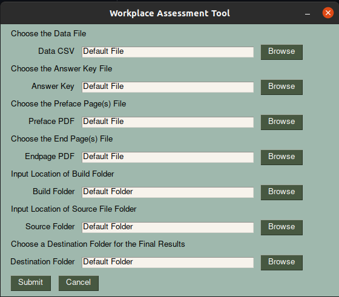

# Curiosity Based Analysis Tool

Welcome, Curiosity Based! This is the public GitHub repository where you can download the analysis tool whenever you need it.

## Downloading the Application
To download the application, all you need to do is to download the ZIP of the repository by clicking the green "Code" button above. **Extract the contents** to your location of choice on your computer.

## Materials Needed For the Application
To use the application, you will need the following:
1. The **Raw Data** from Microsoft Forms in an excel sheet (.xlsx). The sheet the raw data is on should be titled "RawData"
2. The **Answer Sheet** in an excel sheet (.xlsx). The sheet that the Answer Sheet is on should be titled "AnswerSheet"

_Note: The raw data and the answer sheet can be on the same .xlsx if you would like. Just ensure that the individual sheets are titled appropriately_ 

3. A **destination folder** for the output. This is where your files will be located once the application is finished running -- just use your file manager of choice (e.g. Finder, File Explorer) to make the folder in your desired location.

## Running the Application
This is where we generate the results from the provided materials.

1. From the folder you just downloaded from the first section of this guide, navigate to the folder labelled with your computer's operating system (either `Windows` or `MacOS`)
2. Click on either the `Prototype-4-11.app` or `Prototype-4-11.exe` to run the application. **It can take up to 2 minutes** to fully open and show the upload screen shown below

3. You may either type the absolute path to the corresponding files/folders in the fields provided, or you can use the `Browse` buttons to fill in the text boxes. When you're ready, go ahead and hit `Submit` or `Cancel` if you need to make changes to the files before generating the results.
4. Once the application is done processing the data, all pdfs and images can be found in the destination folder you specified.

And that's it! If you have any further questions or issues, contact Joyce Elauria at jaelauria@gmail.com