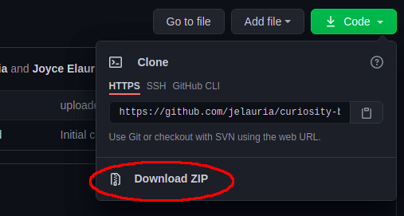

# Curiosity Based Analysis Tool

Welcome, Curiosity Based! This is the public GitHub repository where you can download the CB Results Generator whenever you need it.

## Downloading the Application
To download the application, all you need to do is to download the ZIP of the repository by clicking the green "Code" button above. **Extract the contents** to your location of choice on your computer.

## Installing Dependencies
The CB Results Generator requires `wkhtmltopdf` in order to run (this is additional software used for generating PDF documents), so **please ensure that it is installed on your computer before running the application**. You can download `wkhtmltopdf` here: https://wkhtmltopdf.org/downloads.html

## Materials Needed For the Application
To use the application, you will need the following:
1. The **Raw Data** from Microsoft Forms in an excel sheet (.xlsx).
2. The **Answer Sheet** in an excel sheet (.xlsx).
3. The **Preface PDF** -- this is the custom PDF of the pages you have designed to go in front of the user's final results.
4. The **Endpage PDF** -- this is the custom PDF of the pages you have designed to go after the user's final result (generally, a glossary of definitions).
5. The **Build Folder** -- this is a folder that can be deleted shortly after the final results have been generated; it will be used to store the intermediate images and pages used to form the final results. The folder should be empty at the time you run the application.
6. The **Source Folder** -- this is a folder that stores reusable intermediate files used to generate the results. This folder comes with downloading the application from GitHub, and is labeled `source`. You're free to move this fold wherever you would like on your computer.
7. A **Destination Folder** for the output. This is where your files will be located once the application is finished running -- just use your file manager of choice (e.g. Finder, File Explorer) to make the folder in your desired location.

## Running the Application
This is where we generate the results from the provided materials.

1. From the folder you just downloaded from the first section of this guide, navigate to the folder labelled with your computer's operating system (either `Windows` or `MacOS`)
2. Click on either the `CB Results Generator.app` or `CB Results Generator.exe` to run the application. **It can take up to 2 minutes** to fully open and show the upload screen shown below

3. You may either type the absolute path to the corresponding files/folders in the fields provided, or you can use the `Browse` buttons to fill in the text boxes. When you're ready, go ahead and hit `Submit` or `Cancel` if you need to make changes to the files before generating the results.
4. Once the application is done processing the data, all pdfs and images can be found in the destination folder you specified.

And that's it! If you have any further questions or issues, contact Joyce Elauria at jaelauria@gmail.com
